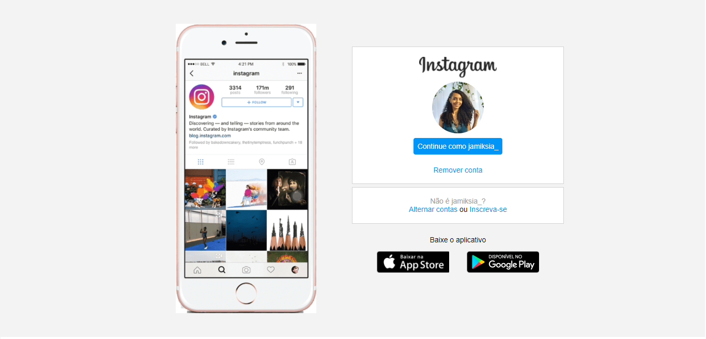

# Recriando a tela do Instagram :camera: 

:eight_spoked_asterisk: Esse projeto foi baseado no Bootcamp Html Web Developer da plataforma Digital Innovation One.

###  :computer: Tecnologias Utilizadas:

* HTML
* CSS

### :calendar: Futuras Atualizações

Pretendo personalizar o projeto na parte de CSS:

* Criando uma borda personalizada para tela
* Criando o modo tela escura
